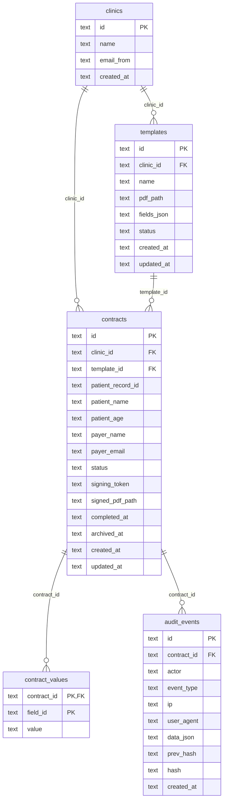

# Technical Overview

This document describes the current implementation in this repository. It is based on the checked-in code and configuration only. Unverified or missing areas are marked as uncertain.

## Architecture

Cardinal Contracts is a single Fastify application written in TypeScript.

- `src/server.ts` owns the HTTP server, route registration, request validation, static file serving, and workflow orchestration.
- `src/db.ts` opens the SQLite database with `better-sqlite3`, enables WAL mode and foreign keys, creates tables, inserts the default clinics, and exposes record types plus `fieldsFor()`.
- `src/pdf.ts` generates completed PDFs by stamping values and signature images onto the original template PDF with `pdf-lib`, then appending a signing certificate page.
- `src/email.ts` sends signing links, signer identity-verification codes, and completed-PDF copies through Resend when `RESEND_API_KEY` is configured.
- `src/audit.ts` writes hash-chained audit events to SQLite (`hash = sha256(prev_hash + canonical_event_json)`), verifies the chain, and archives a contract's trail before permanent deletion.
- `src/otp.ts` holds the pure helpers for signer email verification: code generation, HMAC hashing, constant-time comparison, and email masking.
- `public/index.html` and `public/main.js` implement the admin UI for clinics, templates, sending, and contract management.
- `public/sign.html` and `public/sign.js` implement the public signer flow.

The server exposes three static roots:

- `/` serves `public`.
- `/uploads/` serves uploaded template PDFs from `UPLOAD_DIR`.
- `/storage/` serves signed PDFs from `STORAGE_DIR`.

The frontend is not bundled. Admin PDF rendering loads PDF.js from a CDN in `public/main.js` and `public/index.html`.

## Current Feature Behaviour

### Clinics

The database bootstraps three clinics: `clinic_promis_hay_farm`, `clinic_promis_london`, and `clinic_cardinal`.

`GET /api/clinics` returns the clinic list but, like all admin routes, is now gated to tailnet/internal or allowlisted access (see [Access Control](#access-control)); creating and deleting clinics additionally require the admin bearer token. Clinic deletion is blocked when templates or contracts reference the clinic.

### Templates

Admins upload PDFs with `POST /api/templates/upload`. Uploaded files are stored as `<template-id>.pdf` in `UPLOAD_DIR`; the template row stores the absolute PDF path.

Template fields are saved with `PUT /api/templates/:id/fields`. Supported field types are:

- `text`
- `number`
- `date`
- `signature`
- `checkbox`

Each field stores normalized page coordinates (`x`, `y`, `w`, `h`) between 0 and 1, a 1-based page number, a required flag, and an optional source mapping. Source mappings currently supported by the API are `patientName`, `patientAge`, `payerName`, `payerEmail`, and `manual`.

Saving fields from the admin UI sets the template status to `active`. Only active templates can be used to create contracts.

### Contract Creation And Sending

Admins create contracts with `POST /api/contracts`. The API validates the template, checks that it is active, checks that the clinic exists, creates a contract with status `pending`, and generates a unique signing token.

Fields mapped to patient or payer data are prefilled into `contract_values`.

The signing URL has this shape:

```text
{APP_URL}/sign.html?token={signing_token}
```

If `RESEND_API_KEY` is present, the application sends the signer an email through Resend. If it is absent, the response records `sent: false` with a reason and still returns the signing URL.

### Signing

The public signer flow loads contract data with `GET /api/sign/:token`. Archived or expired contracts return HTTP 410. The route writes a `contract.opened` audit event every time it is called. The response also tells the signer UI whether email verification is required (`identity.required`), whether the current browser session has passed it (`identity.verified`), and carries the canonical consent statement and version presented at signing.

**Link expiry.** Contracts carry `expires_at` (default 30 days, `SIGNING_TOKEN_DAYS`). An expired pending contract returns 410 with a `contract.expired` audit event (written once); admins can extend (`POST /api/contracts/:id/extend`) or re-send (`POST /api/contracts/:id/resend`) the link.

**Signer identity verification (email OTP).** When `RESEND_API_KEY` is configured (and `SIGNER_OTP_ENABLED` is not `false`), the signer must verify before completing:

1. `POST /api/sign/:token/otp` (no body) emails a 6-digit code to the payer address. Only an HMAC of the code is stored (keyed by `ADMIN_TOKEN`), with a 10-minute expiry, 5-attempt limit, and a 30-second resend throttle. Audit: `identity.challenged`.
2. `POST /api/sign/:token/otp` with `{ code }` verifies (constant-time), grants an httpOnly session cookie (2 hours, `signer_sessions` table) scoped to the contract. Audit: `identity.verified` (with IP/UA).
3. `POST /api/sign/:token/complete` rejects unverified signers with 403 `identity_required`.

Without an email provider the step is skipped and completions are recorded with `identityMethod: unverified` — the same degradation the signing email itself has.

**Document viewing.** `POST /api/sign/:token/viewed` records a one-time `document.viewed` audit event when the signer UI renders the PDF — evidence the signer saw the document, not just the form.

The signer submits values to `POST /api/sign/:token/complete`. The body must include `consentAccepted: true` alongside the field values; the server rejects submissions missing required fields, missing consent, archived/expired contracts, and already completed contracts. On success it:

1. Upserts submitted values into `contract_values`.
2. Generates a signed PDF in `STORAGE_DIR`: values and signature images stamped onto the template, then a **signing certificate page** appended containing the contract ID, patient record, signer name/email, signer IP at completion, document first-viewed timestamp, completion timestamp, the verbatim consent statement (with version), and the SHA-256 of the document content pages (excluding the certificate itself).
3. Computes and stores two seals on the contract row: `content_sha256` (pages before the certificate) and `signed_pdf_sha256` (the complete stored file). `GET /api/contracts/:id/verify` re-hashes the stored file against `signed_pdf_sha256` at any time.
4. Sets contract status to `completed` with `completed_at`.
5. Writes a `contract.completed` audit event whose data records the consent statement/version, both hashes, and the identity method (`email-otp` or `unverified`).
6. Emails the signer a copy of the completed PDF (when Resend is configured), recording `contract.copy_sent`.

The signer UI embeds the original uploaded PDF beside the generated form. The completed PDF is not shown to the signer in the browser after signing (their copy arrives by email); the admin dashboard links to it when `signed_pdf_path` exists.

### Audit Log Integrity

Every audit event is chained: `hash = sha256(prev_hash + canonical_json(event))` across all events in insertion order. `GET /api/audit/verify` walks the chain and reports the first inconsistency, making retroactive edits or deletions detectable. (Truncation of the chain's tail is not detectable from inside the table — the off-host daily backups provide that half of the guarantee.) The canonical JSON key order is fixed forever: reordering keys would invalidate every existing hash.

### Archive And Removal

Admin contract listing defaults to active contracts (`archived_at IS NULL`). Passing `archived=true` lists archived contracts.

Archiving sets `archived_at` and blocks future signer access. Restoring clears `archived_at`. Permanent deletion is only allowed after archiving. Before the contract row is deleted, a terminal `contract.deleted` audit event is written containing a snapshot of the contract record and its field values, and the contract's entire audit trail (with hash-chain values intact) is copied to `audit_events_archive` — the evidence outlives the contract. Deletion then removes the contract row, its remaining live events, values, challenges and sessions (cascade), and, when present, the signed PDF file.

## API Flows

### Admin Authentication

Admin routes call `requireAdmin()` and expect:

```http
Authorization: Bearer <ADMIN_TOKEN>
```

The configured token defaults to `change-me` when `ADMIN_TOKEN` is not set.

### Template Setup Flow

1. `GET /api/clinics`
2. `POST /api/templates/upload`
3. Admin UI renders the uploaded PDF through `/uploads/<file>.pdf`.
4. `PUT /api/templates/:id/fields`
5. `GET /api/templates?clinicId=<clinic-id>`

### Contract Sending Flow

1. `POST /api/contracts`
2. Server pre-fills mapped fields in `contract_values`.
3. Server attempts to send email through Resend when configured.
4. API response includes the contract row, `signingUrl`, and email send result.

### Signer Completion Flow

1. `GET /api/sign/:token` — contract data, identity requirement, consent statement
2. If `identity.required` and not verified: `POST /api/sign/:token/otp` (send code, then verify code) — session cookie granted
3. `POST /api/sign/:token/viewed` (UI fires once when the PDF renders)
4. Signer fills fields and checks the consent box in `public/sign.js`
5. `POST /api/sign/:token/complete` with `{ values, consentAccepted: true }`
6. Server writes values, stamps the PDF with certificate + hashes, completes the contract, emails the signer their copy, and records audit evidence.

### Contract Operations Flow

1. `GET /api/contracts?clinicId=<clinic-id>&archived=false`
2. `POST /api/contracts/:id/resend` or `POST /api/contracts/:id/extend` (pending only — re-send the link, give it a fresh expiry window)
3. `POST /api/contracts/:id/archive`
4. `GET /api/contracts?clinicId=<clinic-id>&archived=true`
5. `POST /api/contracts/:id/restore` or `DELETE /api/contracts/:id` (audit trail is archived first)
6. `GET /api/contracts/:id/audit` — full event trail with chain hashes
7. `GET /api/contracts/:id/verify` — re-hash the stored signed PDF against the sealed SHA-256
8. `GET /api/audit/verify` — walk the whole audit hash chain

## Database Relationships

SQLite is the only database used by the checked-in application code.



Relationship details:

- `templates.clinic_id`, `contracts.clinic_id`, and `contracts.template_id` are foreign keys without cascade delete.
- `contract_values.contract_id` cascades when a contract is deleted.
- `audit_events.contract_id` cascades when a contract is deleted, but permanent deletion copies the contract's full trail (chain hashes intact) to `audit_events_archive` first, along with a `contract.deleted` snapshot event.
- `signer_challenges` and `signer_sessions` cascade with their contract.
- Template fields live as JSON in `templates.fields_json`, not in a separate table.
- `contract_values.field_id` has no foreign key because fields are JSON documents rather than rows.

## Known Technical Debt

These items are present in the code or build configuration.

- Authentication is a single shared admin bearer token; there are no user accounts, roles, sessions, or per-clinic admin permissions.
- `ADMIN_TOKEN` defaults to `change-me` if not configured.
- Uploaded template PDFs are served as static files under `/uploads/` (the signer flow renders them). Generated signed PDFs under `/storage/` are now gated to admin/tailnet access (see [Access Control](#access-control)); they remain filename-addressable for admin download.
- There are no webhook callbacks to a patient-record system.
- There is no multi-signer routing or reminder workflow.
- Database migrations are handled inline in `src/db.ts`; additive column checks exist for the evidence-hardening columns, and the audit hash chain backfills in `src/audit.ts`.
- `templates.fields_json` stores field definitions as JSON, so individual fields cannot be referenced by database constraints.
- Rotating `ADMIN_TOKEN` invalidates in-flight signer OTP challenges and sessions (it keys the OTP HMAC); signers mid-flow would need to request a new code after a rotation.
- The test suite covers field types, the IP gate, the audit hash chain, and the OTP helpers; route, PDF-stamping, email, and archive behaviours are exercised manually.
- The signer UI does not restore an already captured signature image from saved values when reloading a partially completed contract.
- The admin frontend depends on CDN-hosted PDF.js at runtime.
- `create_cardinal_standard_room_template.sh` targets the external DocuSeal API, while this app is a separate self-hosted implementation. Keep that script distinct from this app's internal API flows.

## Deployment Assumptions

The repository includes a Dockerfile and `docker-compose.yml`.

The Docker image:

- Uses Node 22 on Debian Bookworm slim.
- Installs native build tooling for dependencies during install and build stages.
- Runs `npm run build`.
- Starts `node dist/src/server.js`.
- Exposes port `4321`.

The compose service:

- Runs one `cardinal-contracts` container.
- Maps host port `4321` to container port `4321`.
- Requires `ADMIN_TOKEN` to be set.
- Sets `DATABASE_PATH=/app/data/contracts.sqlite`.
- Sets `UPLOAD_DIR=/app/uploads`.
- Sets `STORAGE_DIR=/app/storage`.
- Mounts named volumes for `/app/data`, `/app/uploads`, and `/app/storage`.
- Optionally accepts `APP_URL`, `RESEND_API_KEY`, and `EMAIL_FROM`.

Operational assumptions visible in code and config:

- SQLite is used as the system of record.
- Uploaded template PDFs and generated signed PDFs must be persisted separately from the container filesystem.
- `APP_URL` must match the externally reachable base URL for email signing links to work.
- Resend is the only email provider implemented.
- A reverse proxy (Traefik, via Dokploy), TLS termination, and access control of the admin surface are configured in deployment rather than this repository; admin access control is documented in [Access Control](#access-control). Backup and restore are handled externally and are documented in [Backup and Recovery](#backup-and-recovery). Monitoring and log retention are not defined in this repository.

## Access Control

The app is intentionally public — external signers open their signing link (`/sign.html?token=…`) from an email — but the admin UI and admin API must not be reachable from the public internet. An `onRequest` gate (`src/server.ts`, logic in `src/ip-allowlist.ts`) hides every non-signer route, returning `404` so the admin surface is invisible rather than merely forbidden. This is network-level defence in depth; the shared admin bearer token remains the application-level auth (per-user accounts are still future work).

**Public paths (open from anywhere):** `/health`, `/sign.html`, `/sign.js`, `/styles.css`, `/api/sign/:token` and everything the signer flow needs beneath it (`/complete`, `/otp`, `/viewed`), `/uploads/*`.

**Admin paths (everything else):**

- Via the **public domain** (`Host` matching `APP_URL`, i.e. `contracts.docuseal.ink`): admin blocked unless the source IP is in `ADMIN_ALLOW_CIDR` (default none). This is how the Cardinal Framework reaches the admin API — it calls `https://contracts.docuseal.ink` server-side from the cardinal server (public IP `88.202.143.245`, allowlisted via a `docker-compose.override.yml` on the host), keeping the admin token off the browser.
- Via the **tailnet** directly (`http://100.64.0.57:4321`, `Host` = the IP): admin allowed when the source IP is internal (the Tailscale CGNAT range `100.64.0.0/10`, RFC1918, loopback). This is the operator path for the admin UI and field-placement work.

The gate keys off the `Host` header rather than the client IP alone: Docker port-mapping makes a direct tailnet client appear to the container as the bridge gateway (`172.x`), the same private range the reverse proxy connects from, so IP alone cannot separate "public via Traefik" from "direct via tailnet". Traefik routes on `Host`, so a public request always carries the public host. `trustProxy` is enabled so audit events record the real client IP. Denials are logged with the source IP and path.

## Backup and Recovery

Application data is backed up independently of this repository by an operator-managed job (`~/bin/backup-contracts.sh`, scheduled at 00:30 daily via the `com.robinlefever.backup-contracts` LaunchAgent). The job and its snapshots live outside this repo; this section documents the behaviour for operational continuity.

**Source:** the three named Docker volumes of the running contracts container on the Dokploy host (`docuseal`, `100.64.0.57`, reachable publicly as `contracts.docuseal.ink`):

- `…_cardinal_contracts_data` (`/app/data`) — the SQLite database (`contracts.sqlite` plus its `-wal`/`-shm`).
- `…_cardinal_contracts_uploads` (`/app/uploads`) — uploaded template PDFs.
- `…_cardinal_contracts_storage` (`/app/storage`) — generated signed PDFs.

Volumes are discovered at runtime from the container (matched on the `cardinal-contracts-` name prefix), so the job survives Dokploy's per-deploy container and volume suffix changes (e.g. `apq4td`). Each volume is streamed read-only into a gzipped tar via a throwaway `alpine` container, so it depends on nothing inside the application image.

**Destination:** timestamped snapshots under `~/backups/contracts/<YYYY-MM-DD_HHMMSS>/` on the CC server (`cardinal`, `100.64.0.67`), with a `latest` symlink. Because that path lives under the CC server's `/home/rlefever`, the existing nightly `backup-cardinal` rsync pull copies it onward to the operator's local disk, so the data exists in two off-host copies.

**Integrity and retention:**

- Each landed archive is verified with `gzip -t` before the snapshot is promoted to `latest`; a failed volume leaves the partial snapshot in an `in-progress` directory for inspection and does not overwrite `latest`.
- Snapshots older than 30 days are removed, judged by the date in the directory name.
- The Dokploy host itself also has a server-level backup on Hetzner; this job adds an application-aware, cross-host copy.

**Restore** (per volume, after stopping the app):

```bash
gunzip -c <archive>.tar.gz | docker run --rm -i -v <volume>:/dst alpine tar xf - -C /dst
```

For a full restore, recreate or reattach the three Dokploy volumes (`data`, `uploads`, `storage`), then restart the application container.

## Uncertain Areas

- Clinical production compliance requirements are not described in this repository.
- The intended production domain and TLS/proxy topology are not described in this repository.
- Whether audit events should survive permanent contract deletion is not specified in this repository.
